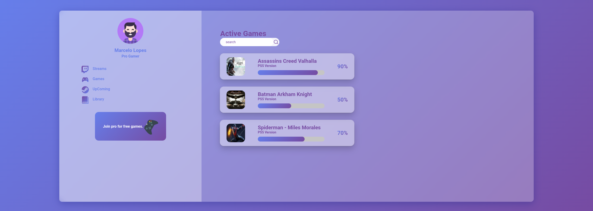

# Glassmorphism

How to Create Glassmorphism UI using React and Styled Components (Como criar a interface do usuário do Glassmorphism usando React e Styled Components)

#### Technology used

- reactJs,
- react-dom,
- react-icons,
- styled-components,
- types/react,
- @types/react-dom,
- @types/styled-components,
- @vitejs/plugin-react,
- typescript,
- vite

---

---

Reproduzido do canal 🇮🇳 Kishan Sheth - youtube.com
